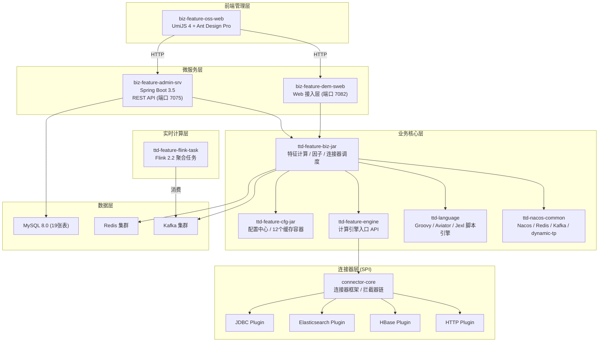
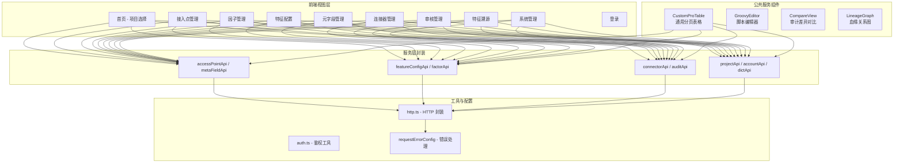
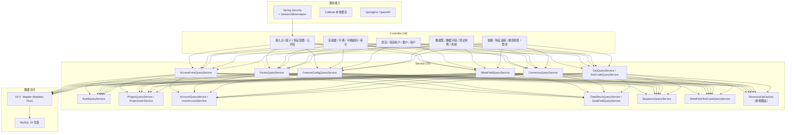
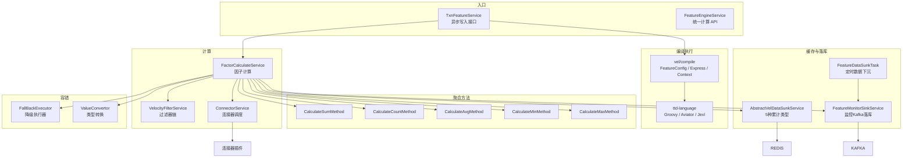
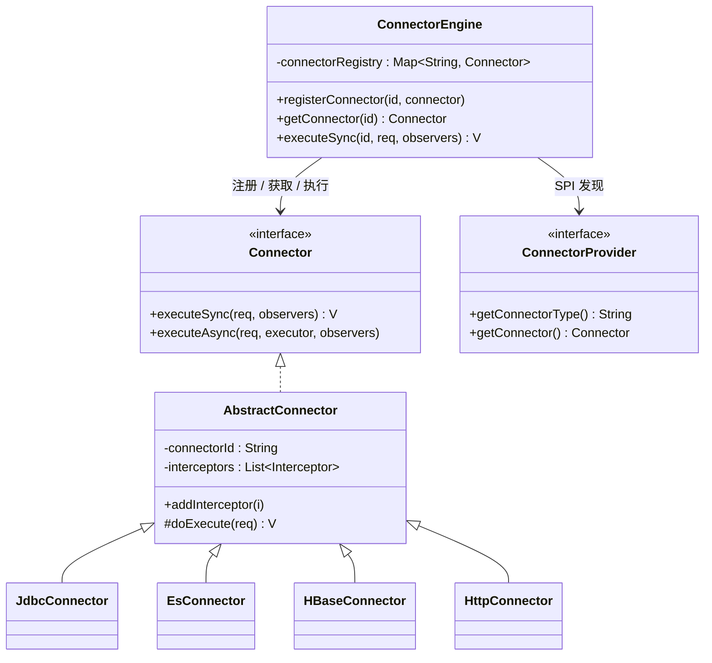
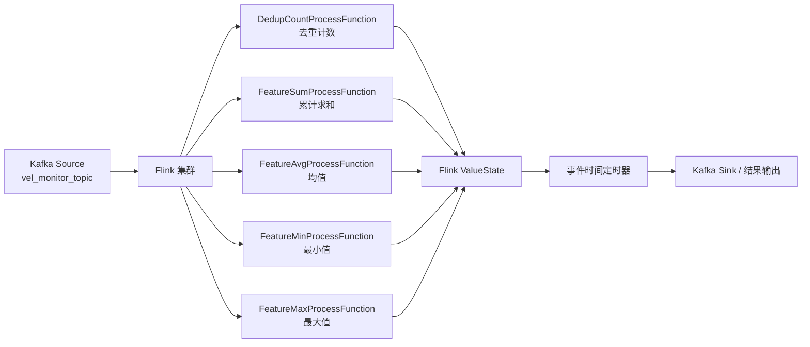
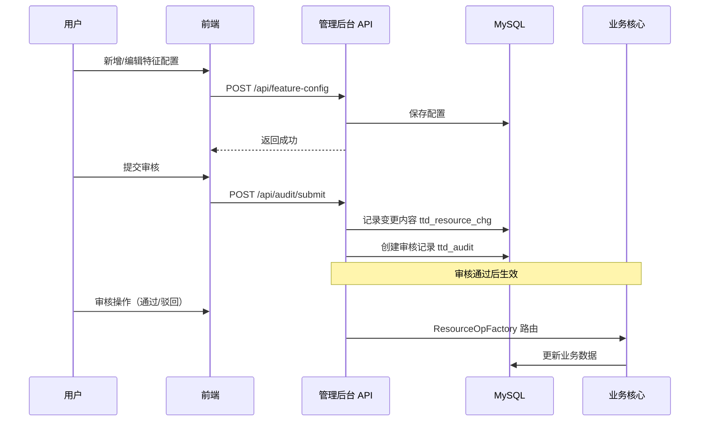
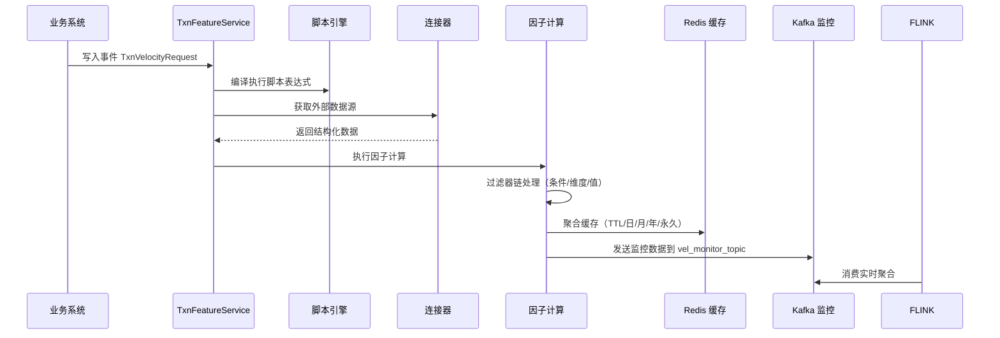

# hxttd_feature 统一特征平台 — 系统架构说明

## 1. 项目定位

统一特征平台（hxttd_feature）为企业提供**统一的特征管理与实时计算能力**
，覆盖从特征定义、因子管理、元字段管理、数据源连接器到实时特征计算、审计审批的全生命周期。平台定位于将分散在各业务线的零散特征工程活动集中化、标准化，消除重复建设，降低特征开发与维护成本。

---

## 2. 整体架构总览

系统采用 **"前后端分离 + 多模块微服务 + SPI 插件化连接器 + Flink 流式计算"** 的四层架构：

### 核心交互说明

| 路径            | 说明                                    |
|---------------|---------------------------------------|
| 浏览器 → 管理后台    | 前端通过 REST API 调用管理后台服务完成业务 CRUD 与审核流程 |
| 管理后台 → 业务核心   | 管理后台调用 ttd-feature 各模块完成特征计算、连接器调度    |
| 业务核心 → 连接器    | 引擎层通过 SPI 路由到具体连接器插件获取外部数据源           |
| Flink → Kafka | 实时聚合任务消费 Kafka 消息，基于事件时间窗口计算          |
| Redis         | 聚合窗口数据缓存，支持 TTL/日/月/年/永久 5 种累计类型      |

---

## 3. 模块分层详解

### 3.1 前端管理层 (biz-feature-oss-web)

基于 **UmiJS 4.x + Ant Design Pro + React 19 + TypeScript** 的单页应用，包含 10 个功能模块、45 个页面文件。

**主要功能页面：**

- **接入点管理**：接入点 CRUD、参数配置、API 文档导出
- **因子管理**：元因子 / 衍生因子 / 因子特征三种类型创建与编辑
- **特征配置**：特征定义、脚本配置、聚合参数设置
- **元字段管理**：元字段 CRUD、Groovy/Aviator 脚本编辑、测试用例管理
- **连接器管理**：JDBC/ES/HTTP 三种连接器类型动态配置
- **审计审核**：审核列表、差异对比视图（8 种资源类型的 CompareView 组件）
- **系统管理**：项目管理、账户管理、字典管理、项目成员

### 3.2 微服务层

#### 管理后台服务 (biz-feature-admin-srv)

Spring Boot 3.5 Web 应用，提供 RESTful API，包含 **18 个 Controller、15 个 Service 模块、19 个 Mapper**：

**关键能力：**

- Spring Security 认证 + SessionIdInterceptor 多租户隔离（X-Project-Id 请求头）
- 统一响应格式 `{code, message, data}`
- Caffeine 本地缓存热点数据
- SpringDoc OpenAPI 自动生成接口文档

#### Web 接入层 (biz-feature-dem-sweb)

Spring Boot 3.5 应用，提供前端 API 代理与部分数据查询能力，包含 MyBatis Mapper（从库），通过 RPC 框架调用管理后台服务。

### 3.3 业务核心层 (ttd-feature)

**核心能力矩阵：**

| 能力     | 实现                                        | 说明                                  |
|--------|-------------------------------------------|-------------------------------------|
| 特征计算链路 | TxnFeatureService → compile → 因子计算 → 缓存落库 | 完整的异步写入管道                           |
| 因子计算   | FactorCalculateServiceImpl                | 元字段查询 + 脚本执行 + 值计算                  |
| 聚合方法   | 5 种 CalculateMethod                       | SUM / COUNT 去重 / AVG / MIN / MAX    |
| 连接器调度  | ConnectorOpFactory 按类型路由                  | JDBC/ES/HBase/HTTP                  |
| 脚本引擎   | LanguageExecuteFactory                    | Groovy 5.0 / Aviator 5.3 / Jexl 3.5 |
| 累计缓存   | AbstractVelDataSunkService                | TTL / 日 / 月 / 年 / 永久                |
| 监控落库   | FeatureMonitorSinkService → Kafka → Doris | 异步 + 幂等设计                           |
| 降级容错   | FallBackExecutor + ValueConvertor         | 异常兜底值返回                             |

### 3.4 连接器插件化架构 (connector-core)

基于 Java SPI 机制的插件化架构，可动态扩展数据源连接器：

- 支持同步/异步执行
- 拦截器链 + 观察者模式（调用链路追踪）
- 4 个内置插件：JDBC、Elasticsearch、HBase、HTTP

### 3.5 Flink 实时聚合层 (ttd-feature-flink-task)

基于 **Flink DataStream API + Kafka Source** 的 5 个实时聚合任务：

**设计要点：**

- 每个聚合任务继承 `AbstractTask`，注入对应的 ProcessFunction、聚合枚举、Kafka Topic 和 Consumer Group
- "事件缓存 + 过期清理 + 定时器触发" 机制
- 基于 `txnId` 的幂等去重
- 动态事件时间窗口

### 3.6 基础设施层 (ttd-nacos-common)

封装企业级中间件操作能力：

| 组件    | 类/工具               | 说明                 |
|-------|--------------------|--------------------|
| 配置中心  | NacosConfigLoader  | 远程配置加载 + 动态刷新      |
| Redis | XRedisTemplate     | Key 序列化 + Lua 脚本支持 |
| Kafka | KafkaClientService | 消息发送 + Kryo 序列化    |
| 动态线程池 | dynamic-tp 1.2.2   | 线程池监控与动态调整         |

---

## 4. 数据流

### 4.1 特征配置管理 → 审核流程

### 4.2 实时特征计算数据流

---

## 5. 数据库设计

基于 **MySQL 8.0**，共 **19 张业务表**，统一设计规范：

| 领域    | 表                                         | 核心字段                               |
|-------|-------------------------------------------|------------------------------------|
| 项目管理  | ttd_project / ttd_project_user            | deleted 逻辑删除 / crt_time / upt_time |
| 用户认证  | ttd_user_account                          | user_account / password            |
| 特征体系  | ttd_feature_config                        | resource_key + version 双标识         |
| 因子管理  | ttd_factor / ttd_factor_dependency        | 血缘关系 parent/child                  |
| 元字段   | ttd_meta_field                            | resource_key / 脚本 / 返回值类型          |
| 元字段用例 | ttd_meta_field_test_case                  | 测试案例与目标值                           |
| 连接器   | ttd_connector                             | connector_type 区分 JDBC/ES/HTTP     |
| 数据集   | ttd_data_struct / ttd_data_field          | 数据结构与字段映射                          |
| 接入点   | ttd_access_point / ttd_access_point_param | API 定义 / 请求参数                      |
| 事件消息  | ttd_event_message                         | 特征处理事件追踪                           |
| 审计审核  | ttd_audit / ttd_resource_chg              | 变更前后内容 JSON                        |
| 字典    | ttd_dict / ttd_dict_code                  | 系统字典与码值                            |
| 序列    | ttd_sequence                              | 分布式 ID 生成                          |

**设计原则：**

- 所有业务表 `deleted` 字段逻辑删除
- 统一 `crt_time` / `upt_time` 时间戳（`upt_time` ON UPDATE CURRENT_TIMESTAMP）
- 核心资源表使用 `resource_key + version` 保持可追溯性

---

## 6. 技术栈清单

| 层次         | 技术                         | 版本                  | 用途        |
|------------|----------------------------|---------------------|-----------|
| **后端框架**   | Spring Boot                | 3.5.0               | 微服务框架     |
| **JDK**    | OpenJDK                    | 17                  | 运行时       |
| **ORM**    | MyBatis-Plus               | 3.5.11              | 数据访问      |
| **数据库**    | MySQL                      | 8.0.33              | 业务数据存储    |
| **连接池**    | Druid                      | 1.2.28              | 数据库连接池    |
| **本地缓存**   | Caffeine                   | 3.1.8               | 热点数据缓存    |
| **分布式缓存**  | Redis / Redisson           | -                   | 聚合窗口/会话缓存 |
| **消息队列**   | Apache Kafka               | 4.2.0               | 异步解耦/事件驱动 |
| **规则引擎**   | Drools                     | 9.44.0.Final        | 业务规则      |
| **脚本引擎**   | Groovy / Aviator / Jexl    | 5.0.4 / 5.3.3 / 3.5 | 可编程特征脚本   |
| **实时计算**   | Apache Flink               | 2.2                 | 窗口聚合任务    |
| **动态线程池**  | dynamic-tp                 | 1.2.2               | 线程池管理     |
| **API 文档** | SpringDoc OpenAPI          | 2.8.7               | 接口文档      |
| **连接器框架**  | 自研 SPI                     | -                   | 可插拔数据源    |
| **RPC 框架** | 自研                         | 2026.0.0            | 服务间调用     |
| **注册中心**   | Nacos                      | -                   | 配置/服务发现   |
| **前端框架**   | UmiJS 4 + Ant Design Pro   | 4.x                 | SPA 框架    |
| **前端语言**   | React + TypeScript         | 19.x                | UI 开发     |
| **代码规范**   | Biome + Husky + commitlint | -                   | 前端质量门禁    |

---

## 7. 架构特性总结

| 特性        | 实现方式                                              |
|-----------|---------------------------------------------------|
| **可扩展性**  | SPI 连接器插件 + 工厂模式路由 + 模块化 Maven 工程                 |
| **高可用**   | Nacos 服务发现 + Redis 集群 + Kafka 集群 + Flink 并行度 3    |
| **异步化**   | TxnFeatureService 异步写入 + FeatureDataSunkTask 定时下沉 |
| **缓存先行**  | Caffeine 本地缓存 + Redis 分布式缓存双层架构                   |
| **降级容错**  | FallBackExecutor 异常降级 + ValueConvertor 类型安全转换     |
| **幂等设计**  | 基于 txnId 去重，保证最终一致性                               |
| **审计可追溯** | 统一审核流程 + 变更前后 JSON 对比 + 8 种资源类型差异视图               |
| **多租户**   | SessionIdInterceptor + X-Project-Id 请求头隔离         |
| **实时计算**  | Flink DataStream + Kafka + 事件时间窗口 + 5 种聚合语义       |
